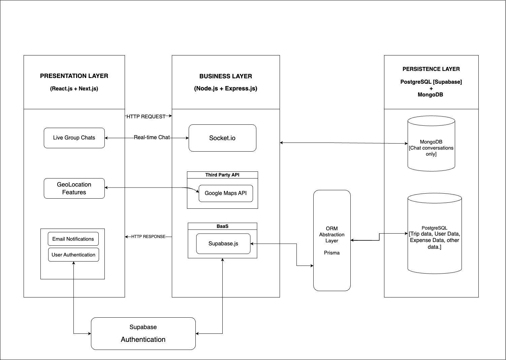

# Vamoose! - Comp 4350

## Table of Contents

- [Description](#description)
- [Documents](#documents)
- [Installation](#installation)
- [Contributing](#contributing)
- [Team](#team)
- [Meeting Times](#meeting-times)

## Description

**Vamoose!** is an intuitive group trip planning app designed to help friends, families, and teams organize their travel plans with ease. Whether you're planning a vacation, a business trip, or a group event, Vamoose! consolidates all your trip details in one convenient platform. The app allows users to plan and share itineraries, track and split expenses, collaborate on packing lists, and communicate in real-time.

Key features include:
- **Trip Planning Dashboard**
- **Expense Tracking**
- **Real-Time Chat & Voting**
- **Interactive Map & Location Sharing**
- **Itinerary Builder**
- **Packing List & Task Assignments**

Vamoose! aims to make group trip planning seamless and fun, removing the stress of coordination and allowing users to focus on enjoying their time together.

## Documents

- [Proposal Document](./Documentation/project_proposal.md)

## Architecture

## Installation

## Contributing
Please follow the [Contributing Guidelines](./Documentation/CONTRIBUTING.md).

## Team

- **Raman Bhandari** (Team Lead)  
  Email: bhandar1@myumanitoba.ca  
  **Roles:** Full Stack and Testing

- **Pritha Das**  
  Email: dasp4@myumanitoba.ca  
  **Roles:** Backend Focused

- **Chukwunaza Chukwuocha** (Chuks)  
  Email: chukwuo1@myumanitoba.ca  
  **Roles:** Backend Focused

- **Anmolpreet Khangura** 
  Email: khangura@myumanitoba.ca  
  **Roles:** Full Stack

- **Anmolpreet Singh**  
  Email: sin121@myumanitoba.ca  
  **Roles:** Full Stack

## Meeting Times

- **Tuesday:** 6:00 PM
- **Saturday:** 2:00 PM

